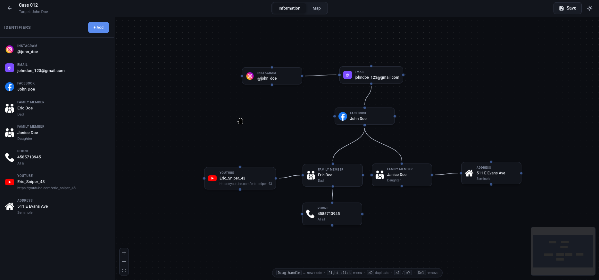
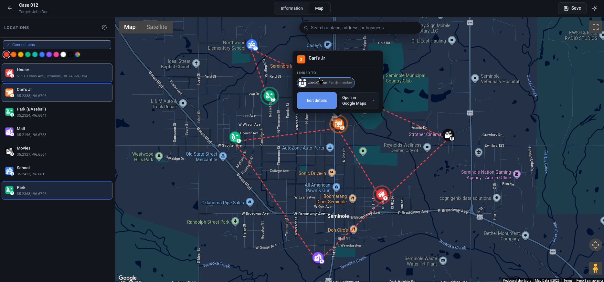

<div align="center">

# OSINT Mapping Tool

**A free, open-source web tool for organizing your OSINT research.**

Map identifiers (social profiles, contacts, vehicles, …), pin visited locations on Google Maps, and connect the two — all stored locally on your machine.

[](https://react.dev)
[](https://vitejs.dev)
[](LICENSE)
[](#privacy)

</div>

---

## ✨ Highlights
- 🌐 **100% web-based*** Everything takes place on your web browser making it accessible for all operating systems.
- 🔒 **100% local** — no backend, no telemetry, no cloud accounts. Projects live as plain JSON on your disk.
- 🧠 **Identifier graph** — 20 built-in types (Instagram, Facebook, Snapchat, Phone, Vehicle, etc.), a Blender-style node canvas to drag-connect them, real brand icons.
- 🔗 **Cross-linking** — wire any pin to any identifier, with optional context notes. Hover an identifier → its pins pulse on the map.
- ⌨️ **Keyboard-first** — undo/redo (Ctrl+Z/Y), copy/paste/duplicate (Ctrl+C/V/D), Del to remove, right-click for quick-add menu.
- 🌗 **Dark + light themes** with theme-aware brand and place-type icons.

## 📸 Screenshots





<br>

<h2 align="center"> 🛠 Stack </h2>

<div align="center">

|Name |Purpose |
|:---|:---|
| UI | React 18, Vite |
| Node graph | [`@xyflow/react`](https://reactflow.dev) |
| Maps | [`@vis.gl/react-google-maps`](https://visgl.github.io/react-google-maps/) |
| State | React Context (no Redux / no store libs) |
| Storage | Local JSON files (projects) + `localStorage` (settings, custom icons) |

</div>

<br>

<h2 align="center"> 🚀 Getting started </h2>

### Prerequisites

- **Node.js 18 or newer**
- **npm** (or pnpm/yarn — the lock file is npm)

<br>

### Install & run

```bash
git clone https://github.com/anonymousRAID/OSINT-Mapping-Tool
cd OSINT-Mapping-Tool
npm install
npm run dev
```

Then open <http://localhost:5173>.

### Build for production

```bash
npm run build       # outputs to ./dist
npm run preview     # serves dist locally on port 4173
```
<br>

## 🗺 Google Maps setup

The Map tab needs a Google Maps API key. **Your key stays on your device** — it's never committed, never sent off-device.

### 1. Get a key

1. In **Google Cloud Console** → APIs & Services → **Credentials** → **Create credentials → API key**.
2. Under **APIs & Services → Library**, enable:
   - **Maps JavaScript API** _(required)_
   - **Geocoding API** _(for address auto-fill)_
   - **Places API** _(for business names + place-type detection)_
3. _(Recommended)_ In **Maps Management → Map Styles**, create a Map Style and copy its **Map ID**.
4. _(Required for security)_ On the key, set **Application restrictions → HTTP referrers** to `http://localhost:5173/*` (and any other origins you'll use).

### 2. Use the key

**Option A — In-app (easiest):** Open the Map tab on first run, paste your key into the setup screen, and click Save. Stored in this browser's `localStorage`.

**Option B — Config file (portable):** Copy the template and fill in your values:

```bash
cp public/app.config.example.json public/app.config.json
```

```json
{
  "googleMaps": {
    "apiKey": "AIzaSyD…",
    "mapId": "abc123def456…"
  }
}
```

`public/app.config.json` is **gitignored** — your real key won't accidentally get committed.

### Which one wins?

`localStorage` takes precedence over the config file, so the in-app setup overrides whatever is on disk. Clear it from **Map → ⚙ settings → Clear key** to fall back to the file.

## 💾 Saving & loading projects

- Click **Save** to download the current state as `<project-name>.osint.json`.
- Click **Open Project** on the landing screen and pick any `.osint.json` to restore it (identifiers, connections, pins, icons, settings — everything).
- The format is plain JSON with a versioned schema; future versions of the app will keep loading older files.
- `.osint.json` files are **gitignored** by default, so accidentally saving one into the repo folder won't commit your research.

## 🧰 Features in depth

### Information tab — identifier graph

- **20 built-in types** across 5 categories (Social, Contact, Personal, Vehicle, Other) with typed fields per type (e.g. Instagram has username, followers, following, posts, bio, …).
- **Drag a handle to another node** to connect them. Drag to empty space → Blender-style menu pops up to spawn a new node.
- **Right-click** the canvas for a free-floating quick-add menu.
- **Per-identifier icon picker** with brand icons (Instagram, Facebook, X/Twitter, YouTube, TikTok, LinkedIn, Snapchat, Discord, Telegram, Google, Spotify, WhatsApp). Upload your own — saved per-browser in `localStorage`.
- **Keyboard shortcuts** (suppressed inside inputs/modals):
  - `⌘/Ctrl + Z` — undo · `⌘/Ctrl + Shift + Z` or `⌘/Ctrl + Y` — redo (up to 20 actions)
  - `⌘/Ctrl + C / V` — copy / paste · `⌘/Ctrl + D` — duplicate
  - `Del` or `Backspace` — remove selected nodes or edges
- Multi-select via marquee or `Shift+click`; bulk actions tracked as a single history entry.

### Map tab — location pins

- **Click anywhere** to drop a pin. Clicking a Google POI auto-fills the place name + address + matching icon.
- **10 built-in place icons** (coffee, food, gym, home, movie, park, amusement park, school, shopping, clothes, library) with theme-aware light/dark variants.
- **Pin colors** (9 presets) and **per-pin icon override**.
- **InfoWindow on click** shows Google Place Details (rating, opening hours, phone, website) + your custom data + linked identifiers + a deep link to Google Maps.
- **"Connect pins" toggle** draws a dashed line between pins in sequence; line color is customizable.

### Cross-linking

- Link a pin to one or more identifiers (e.g. "@johndoe was tagged at this coffee shop on March 14").
- Optional per-link **context note**.
- Click an identifier chip in a pin's info card → **navigates to the Info tab** with that identifier highlighted.
- Hover an identifier in the sidebar → **its linked pins pulse** on the Map tab.

## 📁 Project structure

```
src/
  components/                 # UI components (tabs, modals, pickers)
  context/                    # ProjectContext, NodeHistoryContext, NavigationContext, …
  images/
    icons/                    # Place-type pin icons (light/dark)
    node_icons/               # Brand icons for identifiers
  styles/                     # Global + theme CSS
  utils/                      # projectIO, customIcons, appConfig
  identifierTypes.js          # Identifier type registry + resolvers
  identifierIcons.js          # Identifier brand-icon registry
  mapIcons.js                 # Place-type icon registry + Google-types mapping
  pinColors.js                # Pin color palette
  App.jsx                     # Landing ↔ ProjectView gate
  main.jsx                    # Provider stack + root render
public/
  app.config.example.json     # Template for your API key (committed)
  app.config.json             # Your real key (gitignored)
```

## 🔐 Privacy

- **No analytics, no telemetry, no remote storage.**
- App settings + custom icon library are stored in your browser's `localStorage`.
- Project files (`*.osint.json`) live on your disk wherever you saved them.
- Google Maps requests go **directly from your browser to Google** using your own key — nothing proxies through any other server.
- A `.gitignore` keeps `app.config.json` and `*.osint.json` out of your commits.

## 📜 License

[MIT](LICENSE) — see the LICENSE file for the full text. _(Replace if you'd prefer a different license.)_

## 🤝 Contributing

Pull requests welcome. This is a research tool — please keep changes focused and avoid introducing remote dependencies, analytics, or anything that would compromise the local-first model.

---

<div align="center">
<sub>Built for OSINT researchers, students, and curious tinkerers. All your data, on your machine.</sub>
</div>

